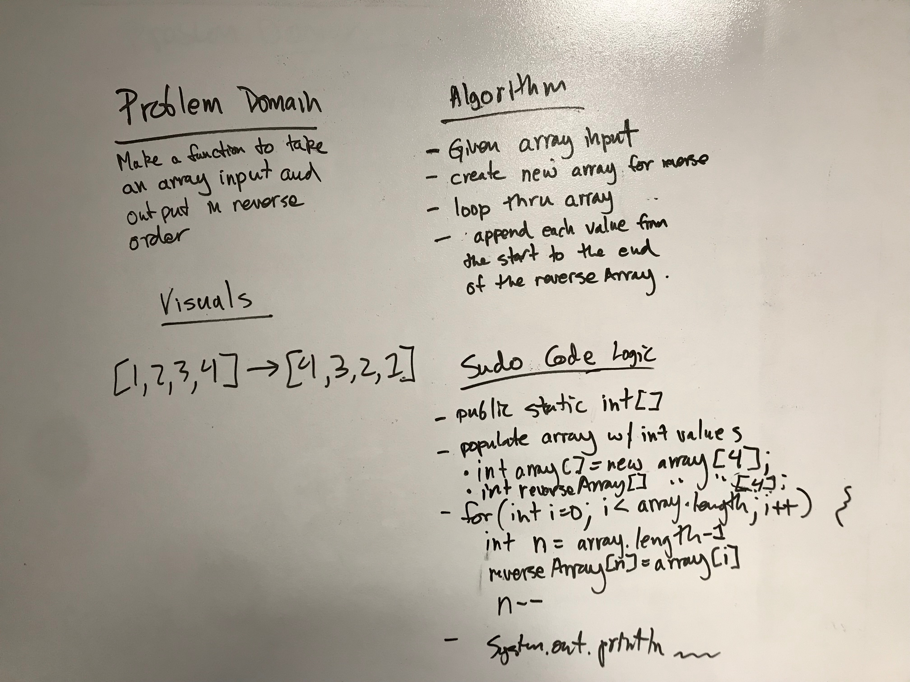

# Reverse an Array
This Java method takes in an array and outputs a new array in reversed order.

## Challenge
Write a function called reverseArray which takes an array as an argument. Without utilizing any of the built-in methods available to your language, return an array with elements in reversed order.

## Approach & Efficiency
The approach taken instantiates an empty reverse-order array, iterates through the ingested array and inserts each array value into the reverse-order array starting from the end of the array.

## Solution

### Checklist

- [x] Read challenge
- [x] Whiteboard challenge
- [x] Set up repos and git stuff
- [x] Code Challenge
- [x] A-C-P and document