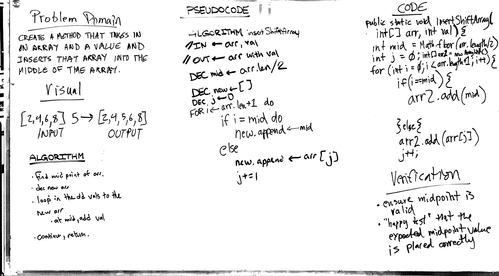

# Challenge 2: Insert and shift middle index of array
This method takes in an array and a value and adds the value into the middle of the array

## Challenge
Write a function called insertShiftArray which takes in an array and the value to be added. Without utilizing any of the built-in methods available to your language, return an array with the new value added at the middle index.

## Approach & Efficiency
The approach is to find the midpoint of an array then iterates through the original array and inserts

## Solution
