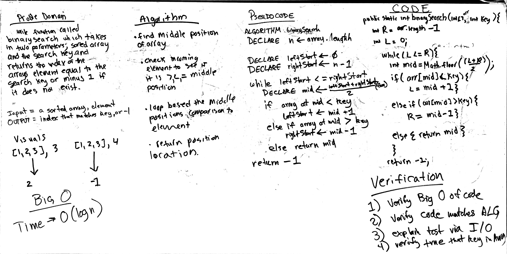

# Challenge 3: Binary Search
Use Binary Search algorithm to find a key position in a sorted array

## Challenge
Write a function called BinarySearch which takes in 2 parameters: a sorted array and the search key, and return the index of the array’s element that is equal to the search key, or -1 if the element does not exist.

## Approach & Efficiency
Time - Big(log n) efficiency achieved from use of binary search methodology

## Solution

### Checklist

- [x] Read challenge
- [x] Whiteboard challenge
- [x] Code Challenge
- [x] Write tests
- [x] A-C-P and document