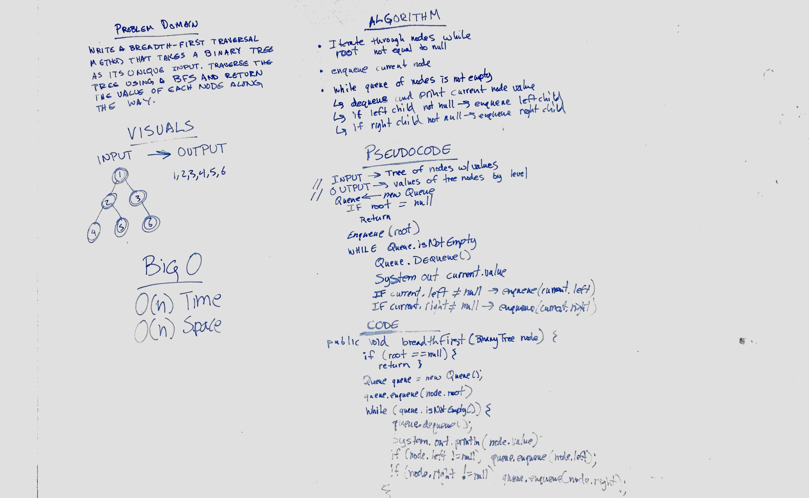

# Challenge 17: Breadth-First Traversal
Create a function that traverses a tree via breadth-first approach

## Challenge
Write a breadth first traversal method which takes a Binary Tree as its unique input and traverses the input tree using a Breadth-first approach; print every visited node’s value.

## Approach & Efficiency
O(n) Time and Space

## Solution

## Checklist

  - [x] Read challenge
  - [x] Whiteboard challenge
  - [x] Code Challenge
  - [ ] Write tests
  - [x] A-C-P and document