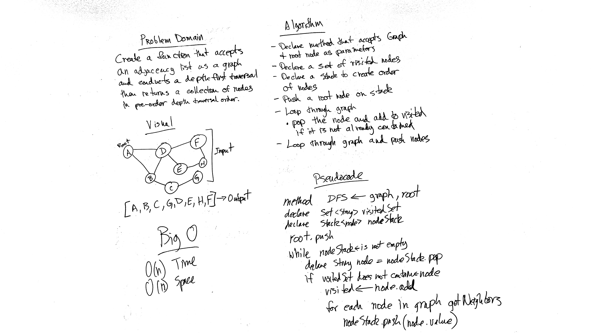

# Challenge 28: Depth First Graph Traversal
Implement depth-first traversal method for a graph

## Challenge
Implement graph object with a depth-first traversal method that accepts a starting node and returns a collection of nodes in the order they were visited. Display the collection.

## Approach & Efficiency
O(n^2) Time
O(n) Space

## Solution

## Checklist

  - [x] Read challenge
  - [x] Whiteboard challenge
  - [ ] Code Challenge
  - [ ] Write tests
  - [x] A-C-P and document

### Reference Documents
* During the course of this lab I referred to the following sites for instruction on building out this challenge
- https://www.baeldung.com/java-graphs
- https://www.dreamincode.net/forums/topic/377473-graph-data-structure-tutorial/