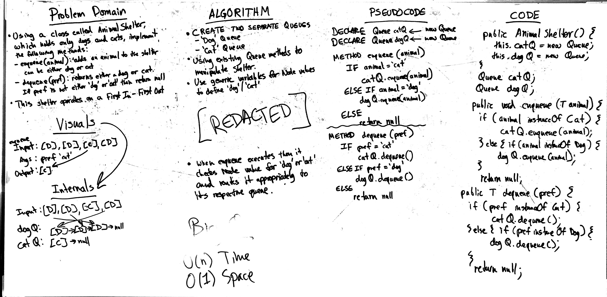

# Challenge 12: FIFO Animal Shelter
Create a queue mimic that returns a 'dog' or 'cat' value

## Challenge
Create a class called AnimalShelter that holds only dogs and cats, and operates using a first-in, first-out approach.

Implement the following methods:
* enqueue(animal): adds animal to the shelter. animal can be either a dog or a cat object.
* dequeue(pref): returns either a dog or a cat. If pref is not "dog" or "cat" then return null.

## Approach & Efficiency
O(n) Time and O(1) Space

## Solution

## Checklist

  - [x] Read challenge
  - [x] Whiteboard challenge
  - [x] Code Challenge
  - [x] Write tests
  - [x] A-C-P and document