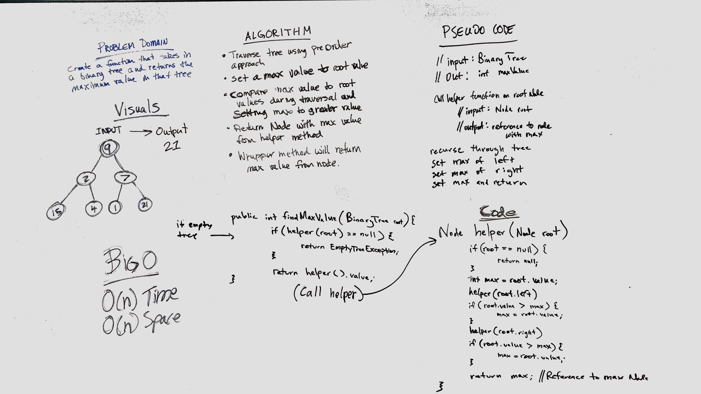

# Challenge 18: Find Max Value of Binary Tree
Create a function that traverses a tree and returns the max value in a node

## Challenge
Write a function called find-maximum-value which takes binary tree as its only input and return the maximum value stored in the tree. You can assume that the values stored in the Binary Tree will be numeric.

## Approach & Efficiency
O(n) Time and Space

## Solution

## Checklist

  - [x] Read challenge
  - [x] Whiteboard challenge
  - [x] Code Challenge
  - [ ] Write tests
  - [x] A-C-P and document