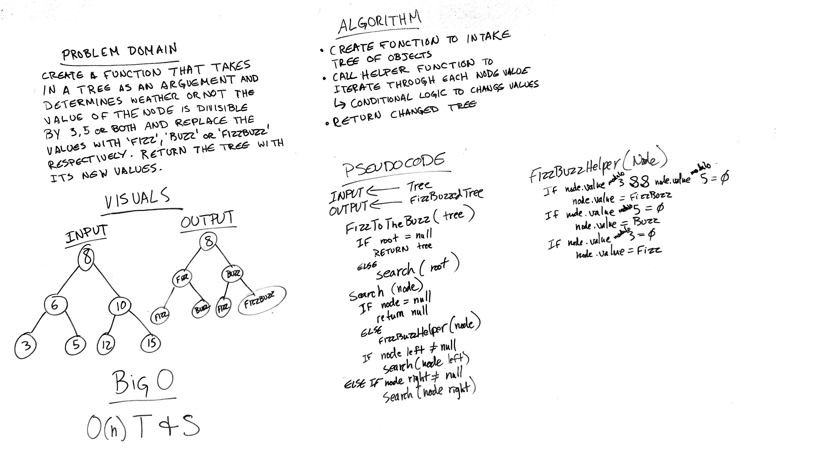

# Challenge 16: FizzBuzz Tree
Implement the 'FizzBuzz' method on the values in a binary tree

## Challenge
Write a function called FizzBuzzTree which takes a tree as an argument that will do the following:
* Determine weather or not the value of each node is divisible by 3, 5 or both, and change the value of each of the nodes:
* If the value is divisible by 3, replace the value with “Fizz”
* If the value is divisible by 5, replace the value with “Buzz”
* If the value is divisible by 3 and 5, replace the value with “FizzBuzz”
* Return the tree with its new values.

## Approach & Efficiency
O(n) Time and Space

## Solution

## Checklist

  - [x] Read challenge
  - [x] Whiteboard challenge
  - [x] Code Challenge
  - [x] Write tests
  - [x] A-C-P and document