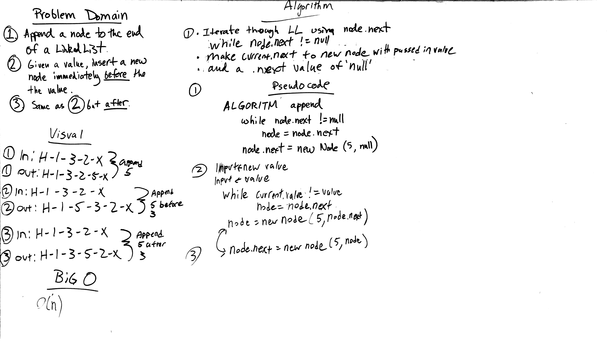

# Challenge 6: Linked List Insertions
Write three new insertions methods for the Linked List class: append, addBefore, addAfter

## Challenge
Write the following methods for the Linked List class:
* .append(value) which adds a new node with the given value to the end of the list
* .insertBefore(value, newVal) which add a new node with the given newValue immediately before the first value node
* .insertAfter(value, newVal) which add a new node with the given newValue immediately after the first value node

## Approach & Efficiency
Big O for linked lists in this case will be O(n) Time.

## Solution

## Checklist

  - [x] Read challenge
  - [x] Whiteboard challenge
  - [x] Code Challenge
  - [x] Write tests
  - [x] A-C-P and document
