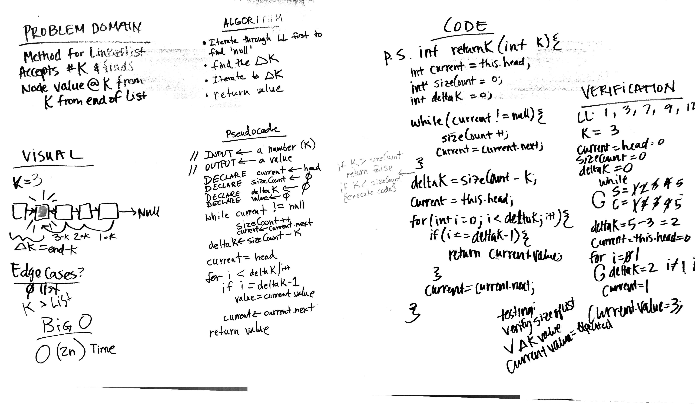

# Challenge 7: Return the Kth Value From the End of a Linked List
Write a method that returns the value of a node that is K distance from the end of the LL

## Challenge
Write a method for the Linked List class which takes a number, k, as a parameter.
Return the node’s value that is k from the end of the linked list.
You have access to the Node class and all the properties on the Linked List class as well as the methods created in previous challenges.

## Approach & Efficiency
Big O for linked lists in this case will be O(2n) Time. Once to iterate for size of list and another to insert.

## Solution

## Checklist

  - [x] Read challenge
  - [x] Whiteboard challenge
  - [x] Code Challenge
  - [x] Write tests
  - [x] A-C-P and document