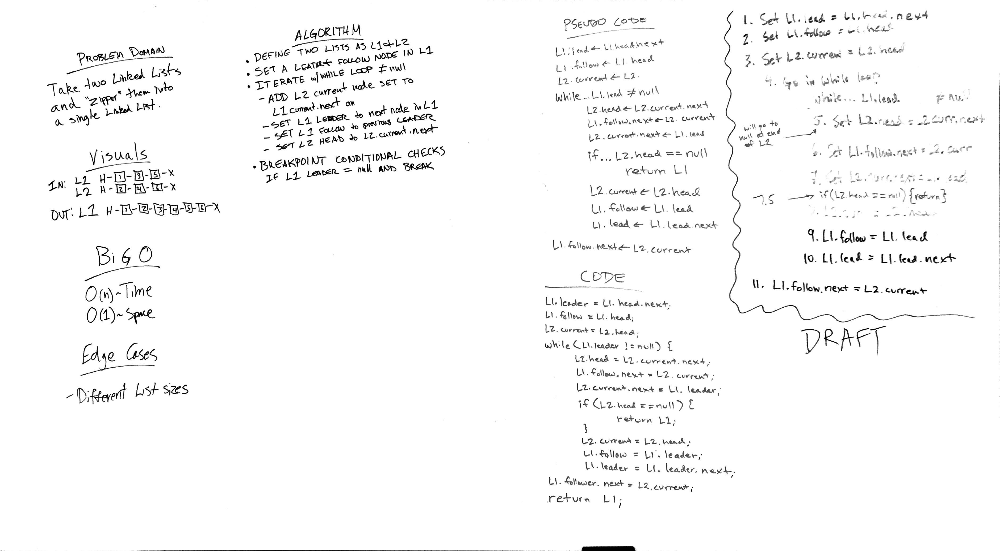

# Challenge 8: Merge two Linked Lists
Take two linked lists as arguments and zip the two linked lists together

## Challenge
Write a function called mergeLists which takes two linked lists as arguments.
 Zip the two linked lists together into one so that the nodes alternate between the two lists and return a reference to the head of the zipped list.

## Approach & Efficiency
<!-- What approach did you take? Why? What is the Big O space/time for this approach? -->

## Solution

## Checklist

  - [x] Read challenge
  - [x] Whiteboard challenge
  - [x] Code Challenge
  - [ ] Write tests
  - [x] A-C-P and document