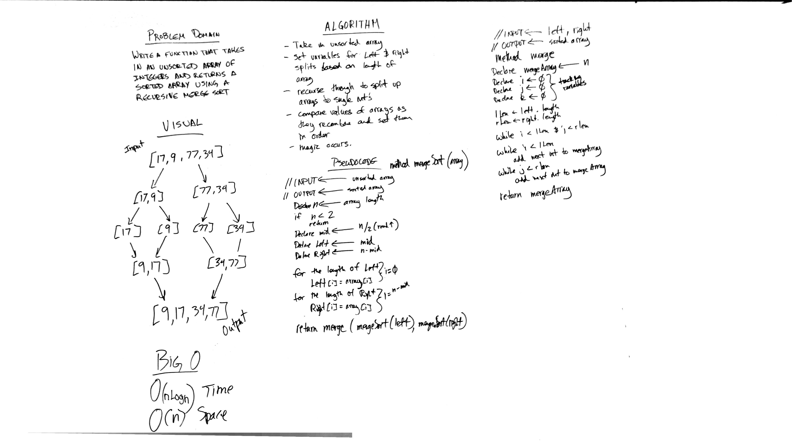

# Challenge 36: Merge Sort
Implement basic functionality methods of a merge sort

## Challenge
Implement a sort algorithm function for merge sort that takes in an unsorted array and returns the array sorted using merge sort.

## Approach & Efficiency
O(nLogn) Time and O(n) Space

## Solution

## Checklist

  - [x] Read challenge
  - [x] Whiteboard Challenge
  - [x] Code Challenge
  - [x] Write tests
  - [x] A-C-P and document

### Reference Documents
* During the course of this lab I referred to the following sites for instruction on building out this lab:
- https://www.baeldung.com/java-merge-sort
- https://www.geeksforgeeks.org/merge-sort/
- http://www.java2novice.com/java-sorting-algorithms/merge-sort/
