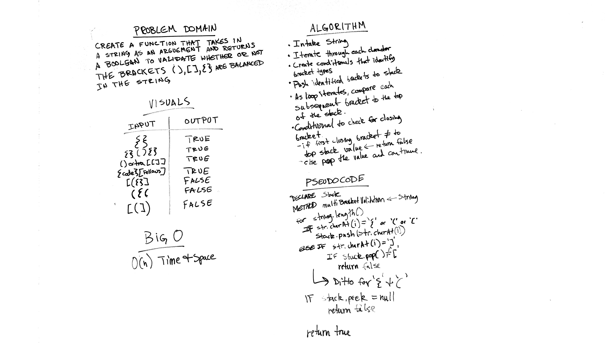

# Challenge 13: Multi Bracket Validation
Create a function that ensures a string that includes brackets are balanced properly

## Challenge
The function should take a string as its only argument, and return a boolean representing whether or not the brackets in the string are balanced. There are 3 types of brackets:

* Round Brackets : ( )
* Square Brackets : [ ]
* Curly Brackets : { }

## Approach & Efficiency
O(n) Time and Space

## Solution

## Checklist

  - [x] Read challenge
  - [x] Whiteboard challenge
  - [x] Code Challenge
  - [x] Write tests
  - [x] A-C-P and document