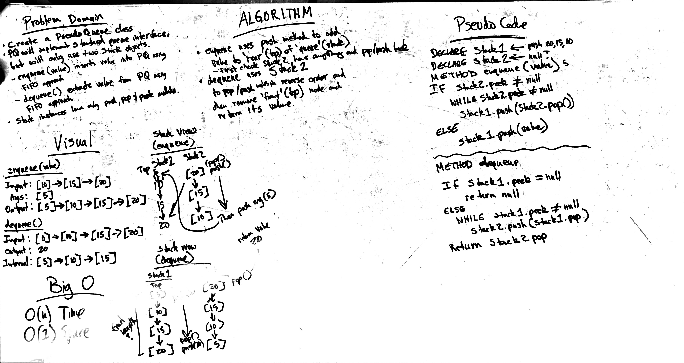

# Challenge 11: PseudoQueue Using Two Stacks
Create common manipulation methods associated with stacks and queues

## Challenge
Create a PseudoQueue class. PseudoQueue class will implement the standard queue interface, but will internally only utilize 2 Stack objects.

PseudoQueue contains the following methods:
* enqueue(value): inserts value into the PseudoQueue, using a first-in, first-out approach.
* dequeue(): extracts a value from the PseudoQueue, using a first-in, first-out approach.

The Stack instances have only push, pop, and peek methods instantiated the PseudoQueue constructor.

## Approach & Efficiency
O(n) Time and O(1) Space

## Solution

## Checklist

  - [x] Read challenge
  - [x] Whiteboard challenge
  - [x] Code Challenge
  - [x] Write tests
  - [x] A-C-P and document