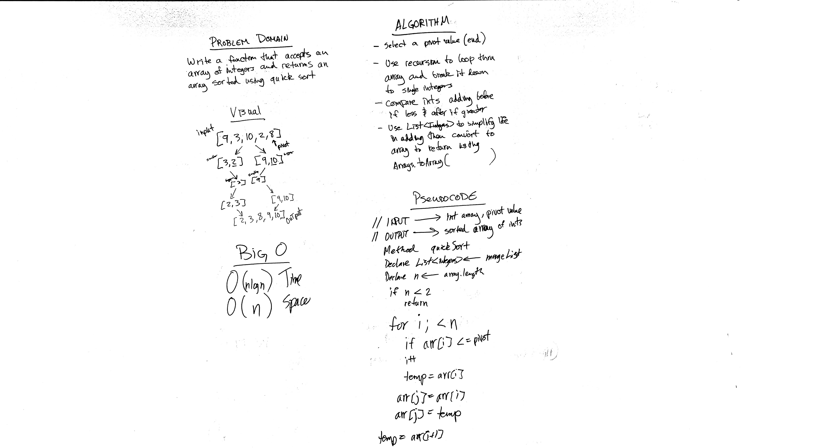

# Challenge 37: Quick Sort
Implement basic functionality methods of a quick sort

## Challenge
Implement a sort algorithm function for quick sort that takes in an unsorted array and returns an array sorted using quick sort.

## Approach & Efficiency
O(nLogn) Time and O(n) Space

## Solution

## Checklist

  - [x] Read challenge
  - [x] Whiteboard Challenge
  - [x] Code Challenge
  - [x] Write tests
  - [x] A-C-P and document

### Reference Documents
* During the course of this lab I referred to the following sites for instruction on building out this lab:
- http://www.java2novice.com/java-sorting-algorithms/quick-sort/
- https://www.baeldung.com/java-quicksort
- https://howtodoinjava.com/algorithm/quicksort-java-example/

