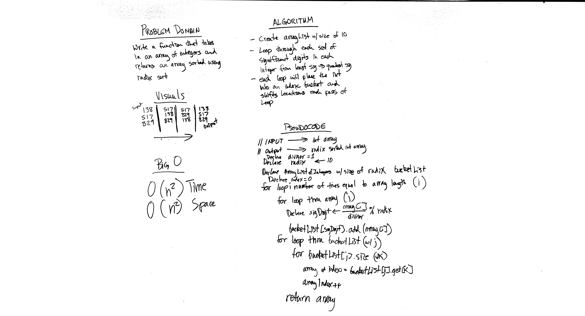

# Challenge 38: RADIX Sort
Implement basic functionality methods of a RADIX sort

## Challenge
Implement a sort algorithm function for RADIX sort that takes in an unsorted array and returns an array sorted using RADIX sort.

## Approach & Efficiency
O(d*(k+n)) Time / O(k+n) Space

## Solution

## Checklist
  - [x] Read challenge
  - [x] Whiteboard Challenge
  - [x] Code Challenge
  - [x] Write tests
  - [x] A-C-P and document

### Reference Documents
* During the course of this lab I referred to the following sites for instruction on building out this lab:
- http://www.java67.com/2018/03/how-to-implement-radix-sort-in-java.html
- https://www.geeksforgeeks.org/java-program-for-radix-sort/
- https://www.thecrazyprogrammer.com/2015/06/radix-sort-java-program-and-algorithm.html

