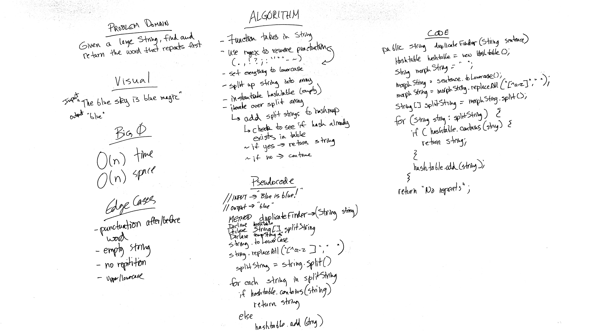

# Challenge 31: Repeated Word in Lengthy String
Implement functionality to find the first repeated word in a book.

## Challenge
Implement a method with the following capabilities:
* Accepts a lengthy string parameter.
* Return the first word to occur more than once in that provided string.

## Approach & Efficiency
O(n) Time and O(n) Space

## Solution

## Checklist

  - [x] Read challenge
  - [x] Whiteboard challenge
  - [ ] Code Challenge
  - [ ] Write tests
  - [x] A-C-P and document

### Reference Documents
* During the course of this lab I referred to the following sites for instruction on building out this lab:
- https://tekmarathon.com/2013/03/11/creating-our-own-hashmap-in-java/
- https://www.hackerearth.com/practice/data-structures/hash-tables/basics-of-hash-tables/tutorial/
- https://coderanch.com/t/667996/java/building-simple-hash-table-scratch
- https://stackoverflow.com/questions/2624192/good-hash-function-for-strings