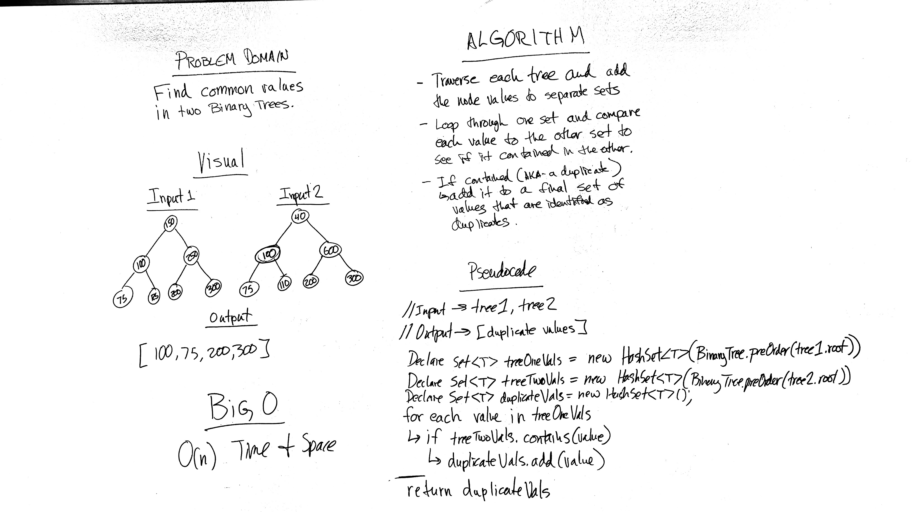

# Challenge 32: Tree Intersection
Implement functionality to find duplicate values in two binary trees.

## Challenge
Implement a method with the following capabilities:
* Accepts two binary trees as parameters.
* Return a set of values found in both trees.

## Approach & Efficiency
O(n) Time and O(n) Space

## Solution

## Checklist

  - [x] Read challenge
  - [x] Whiteboard challenge
  - [x] Code Challenge
  - [x] Write tests
  - [x] A-C-P and document

### Reference Documents
* During the course of this lab I referred to the following sites for instruction on building out this lab:
- None